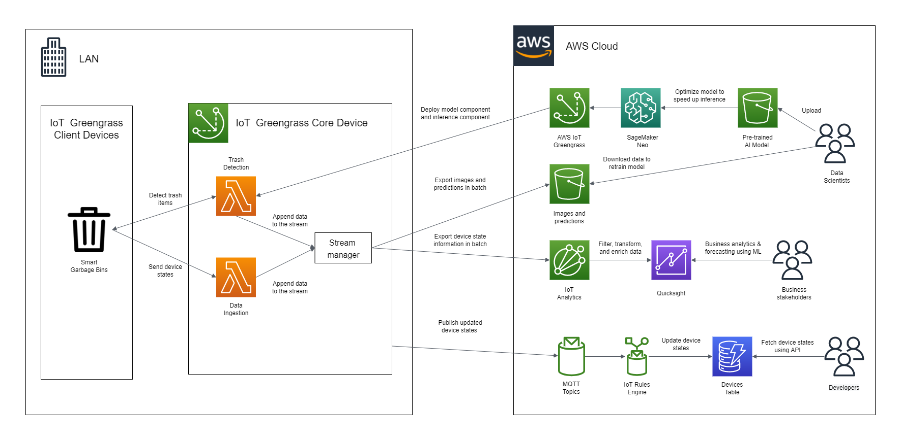
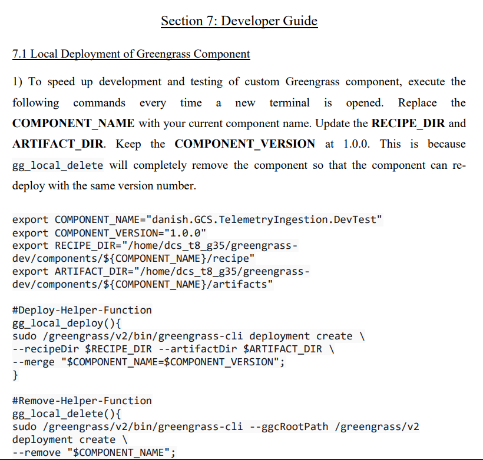
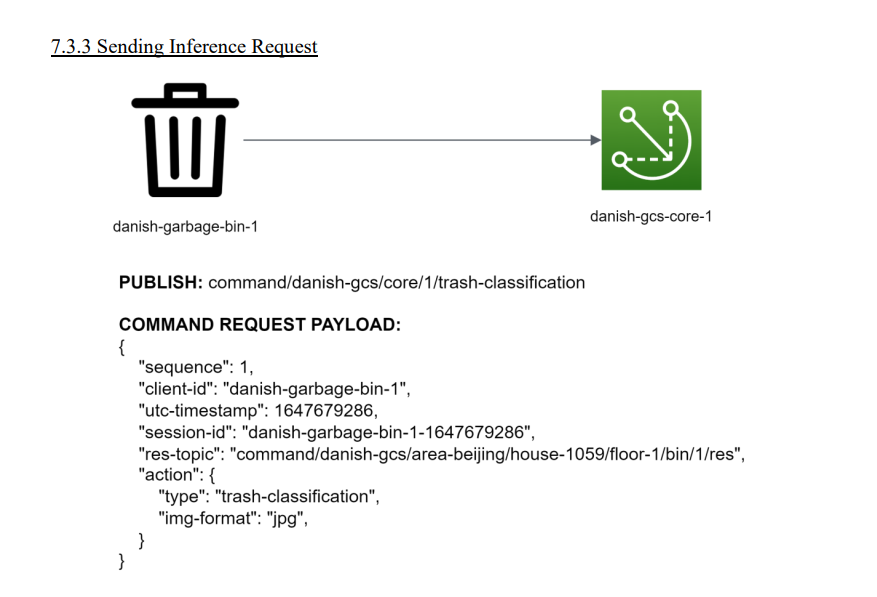
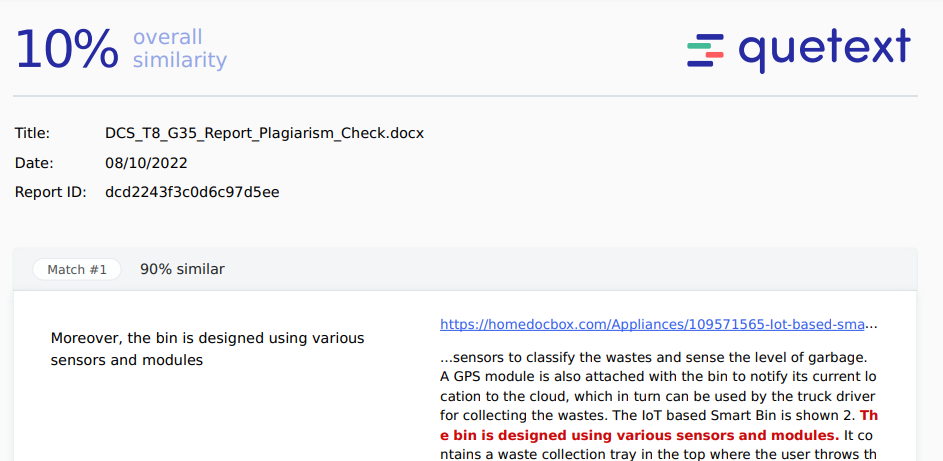
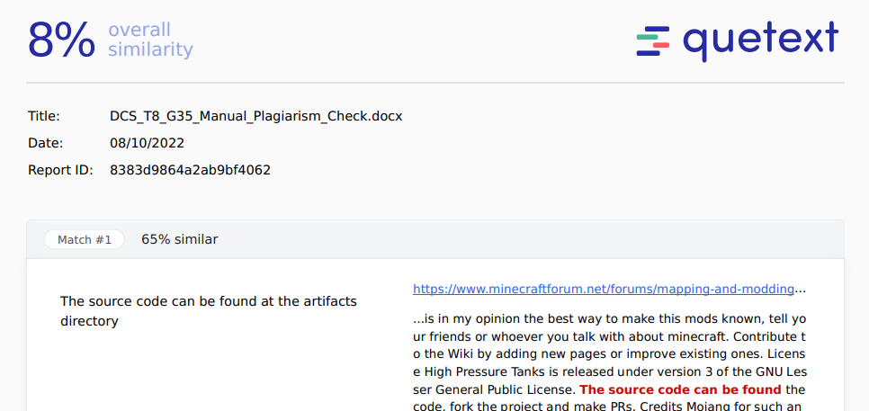

# Danish Garbage Collection IoT System

Below summarizes the important aspects of the IoT system. Download and refer to the <a href="https://github.com/polarBearYap/danish-garbage-collection-iot-sys/blob/main/pdf_documents/DCS_T8_G35_Report.pdf">report</a> and the <a href="https://github.com/polarBearYap/danish-garbage-collection-iot-sys/blob/main/pdf_documents/DCS_202201_T8_G35_Manual.pdf">manual</a> for the full details.

## Table of contents
- [Overview](#overview)
- [Features](#features)
- [Architecture diagram](#architecture-diagram)
- [Project demo](#project-demo)
- [File structure](#file-structure)
- [Technical contribution](#technical-contribution)
- [Project contributors](#project-contributors)
- [Acknowledgement](#acknowledgement)
- [Potential improvement](#potential-improvement)
- [Plagiarism check](#plagiarism-check)

## Overview

The garbage collection system is inefficient in Danish House Student Hostel (which is located in UTAR Kampar campus). Each garbage bin only picked up by employees once per week even though the bin is already full for a few days. Most students are forced to put the trash outside of the garbage bins since the  bins are always full. As a result, the area becomes a breeding ground for pests like cockroach and Aedes. Numerous maggots crawl around the bin, dead cockroaches can be found everywhere in the stairway, surgical masks get thrown outside of bin and flown away... This inevitably will cause health problems to the students.

## Features
1. **AI trash sorting**: The edge device uses a [PyTorch model](https://github.com/sangminwoo/RecycleNet) to automatically sort trash according to its type (e.g. glass, paper, plastic). The garbage bins communicates with the edge device through MQTT protocol for inference requests and replies.
2. **Edge processing**: The edge device preprocesses, filters, and aggregates the telemetry received from the garbage bins before sending the telemetry to the cloud batch-by-batch.
3. **Real-time notification**: Once the edge device sends the fill level of each bin to the cloud, the DynamoDB table will get updated in real-time. The developers can then implement mechanisms such as webhook or GraphQL subscriptions to alert the on-duty garbage workers in real-time when one of the bins is full.
4. **Data analytics**: From the edge device, the telemetry will be sent to the AWS IoT Analytics for data enrichment. Then, the business stakeholders or admins can then visualize the high-level information using Amazon Quicksight to find ways to improve the collection system. 

## Architecture diagram

The main AWS services used are  AWS IoT Greengrass. Two Ubuntu VirtualBox VMs are set up to represent the edge device and one of the IoT garbage bins, respectively.

> Click on the image to enlarge. 

## Project Demo
1. This [video](https://drive.google.com/file/d/1TU0DOtnLf_ZGE4_ZxR7VjM9j-9bCatRP/view?usp=sharing) contains the project background and the demo section of the project in SD quality.
2. This [video](https://www.youtube.com/watch?v=oVDfd2V8ZWI) contains only the demo section of the project in HD quality.

## File structure 

| Directory | Description |
| --- | --- |
| aws-cli | Contain files that are used in aws cli commands |
| bulk_registration | Contain files that are used in bulk registration, should place in core device's VM |
| client_device | Contain files that are used to perform inference and publish fill level telemetry, should place in client device's VM |
| component_recipes | Contain recipes of the components that needed to be configured during deployment |
| core_device | Contain files that are used when installing Greengrass Core software, should place in core device's VM |
| logs | Contain sample log files of a successful Greengrass custom component's deployment |
| pdf_documents | Contain the assignment report and the step-by-step guide to set up the system |
| picture | Contain the architecture diagram of the IoT system and some report screenshots |
| s3_artifacts | Contain files that should be upload to S3 bucket named danish-gcs-model-artifacts-bucket |
| s3_output_files | Contain sample files that are downloaded from the S3 bucket named danish-gcs-image-and-model-output-bucket |

## Technical Contribution

1. As shown in the image below, the manual contains the developer guide on how to develop a custom Greengrass component from a local virtual machine. 

2. As shown in the image below, the manual also describes the best MQTT design patterns as recommended by [AWS](https://docs.aws.amazon.com/whitepapers/latest/designing-mqtt-topics-aws-iot-core/designing-mqtt-topics-aws-iot-core.html). 

## Project contributors
1. Yap Jheng Khin (Leader)
2. Gan Win Sian (Co-leader)
3. Cheow Yue Chen
4. Kesavan a/l Muniandy

## Acknowledgement
Special thanks to Dr Cheng for providing free online introductory AWS course and 50% discount on AWS foundational certificate. Second, I would like to thank Dr Ashvaany for patiently guiding the assignment. Third, I also want to thank Sangmin Woo for sharing the RecycleNet model.

1. Ts Dr Cheng Wai Khuen
2. Dr Ashvaany a/p Egambaram
3. Sangmin Woo

## Potential improvement
1. Infrastructure as a code (IaaC): Use [Terraform](https://www.terraform.io/) and [Ansible](https://www.ansible.com/) to automate the AWS cloud deployment.
2. Containerize the application by [configuring the Greengrass component to run Docker container](https://docs.aws.amazon.com/greengrass/v2/developerguide/run-docker-container.html) to leverage the benefits of containers.
3. Kubernetes: Deploy a lighweight Kubernetes distribution like [K3s](https://k3s.io/) into the edge device and let the Kubernetes controllers automate tasks like failure recovery and scaling.

## Plagiarism check

1. The image below shows the plagiarism result of the report. The full result can be found at [here](./pdf_documents/DCS_T8_G35_Report_Plagiarism_Check.pdf). 

2. The image below shows the plagiarism result of the manual. The full result ccan found at [here](./pdf_documents/DCS_T8_G35_Manual_Plagiarism_Check.pdf).

